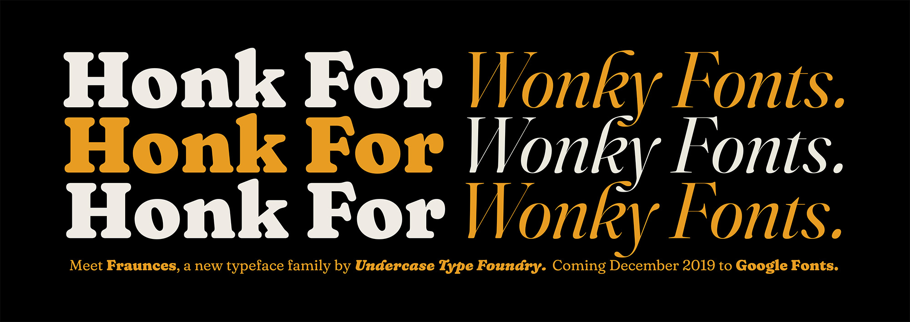

# Fraunces Font Project

Fraunces is a display, "Old Style" soft-serif typeface inspired by the mannerisms of early 20th century typefaces such as [Windsor](http://fontreviewjournal.com/windsor/), Souvenir, and the Cooper Series.

This typeface family is still under development, and will be ready for initial release by the end of 2019.

## What can Fraunces do?

The Fraunces font family is composed of a Roman and Italic, and is being built as a Variable Font. Between these two styles, the family spans 3 axes and 1 binary axis: Weight (0–1000), GOOF (0–100), Optical Size (9–144), and WONK (0 or 1).

### Weight Axis

The weight axis spans Thin to Black. Nuff said.

### GOOF Axis

The "goofy" axis gives access to the chocolate-y, chunky forms that are available towards the Optical Min, but still retaining other Optical Sizing considerations, such as change in character width, spacing, tall ascenders, and shorter x-height

### Optical Size Axis

The optical size axis ties together changes in contrast, x-height, spacing, and character widths. As the optical size decreases, the x-height increases, spacing opens up, and the characters expand in width.

Additionally, mapping of axis values is placed in the AVAR table to create non-linear interpolation in the Variable Font.

Many of the peculiar, wonky characteristics that are suitable for display usage are less desirable for more continuous reading. At certain smaller optical sizes (18px and less), the WONK axis is disabled (see below). 

### WONK Axis

A binary axis that subsitutes "wonky" characters for more normalized characters, such as the leaning n/m/h in Roman, or the bulbous flags in the b/d/h/k/l of the Italic. In traditional instances of fonts, this will be implemented as a Stylistic Set.

